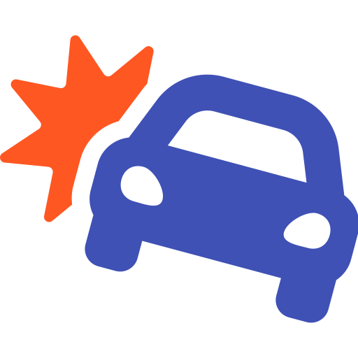

<p align="center">
  <br>
  <small>
    <a href="https://fontawesome.com/icons/car-crash?style=solid" target="_blank"><code>car-crash</code> icon</a> by
    <a href="https://fontawesome.com/" title="FontAwesome" target="_blank">FontAwesome</a>,
    used under
    <a href="https://creativecommons.org/licenses/by/4.0/"
       title="Creative Commons BY 4.0"
       target="_blank">CC BY 4.0</a> / colors changed from original
  </small>
</p>
<h1 align="center">Welcome to Kraftfahrzeug 👋</h1>
<p align="center">
  <a href="https://travis-ci.org/verkehrsministerium/kraftfahrzeug">
    
  </a>
  <a href="https://github.com/verkehrsministerium/kraftfahrzeug/blob/master/LICENSE">
    
  </a>
  <a href="http://makeapullrequest.com">
    
  </a>
  <br>
  <i>A serialization agnostic debugger and inspector for websocket transports</i>
</p>

---

> This project is work-in-progress

## How to use

> TBD

## Installation

> TBD

## Troubleshooting

> TBD

## Development

<details>
<summary>Design notes</summary>

 1. Panes
     - manage panes for inspecting messages and sending a message
     - move focus of pane
     - change contents of statusbar according to pane type
     - view pane name in the lower right corner instead of application name
     - move pane and resize
 2. Design inspect pane
     - TODO
 3. Design send pane
     - TODO
 4. Show messages in abstract object notation (like js objects in google chrome debugger)
     - add highlighting for object notation
        - strings
        - numbers
        - field names
        - parenthesis
        - abbreviations
     - add level based abbreviation for object notation

### Abstract Object Notation

```yaml
{
  null: null,
  bool: true,
  bool2: false,
  int: 42,
  float: 1.0,
  str: "Hello, world",
  array: [1, 2, 3, 4],
  object: { key: "value" },
  binary: <89 50 4e 47 0d 0a 1a 0a...>,
}
```

### Abbreviation for objects

```
{
  data: {
    from: "Sam",
    to: "Max",
    content: "Hello, world!"
  },
  type: "Message"
}
```

to

```
{ data: { from: "Sam", to: "Max", ... }, type: "Message" }
```

> Abbrevations are only present on level `n`, abbreviating all messages deeper than `n` and may abbreviate other message at level `n`. An item on a lower level than `n` (e.g. the root) will never be abbreviated.

</details>

## Authors

**Fin Christensen**

> [:octocat: `@fin-ger`](https://github.com/fin-ger)  
> [:elephant: `@fin_ger@mastodon.social`](https://mastodon.social/web/accounts/787945)  
> [:bird: `@fin_ger_github`](https://twitter.com/fin_ger_github)  

<br>

**Johannes Wünsche**

> [:octocat: `@jwuensche`](https://github.com/jwuensche)  
> [:elephant: `@fredowald@mastodon.social`](https://mastodon.social/web/accounts/843376)  
> [:bird: `@Fredowald`](https://twitter.com/fredowald)  

<br>

**Benjamin Sparks**

> [:octocat: `@bengsparks`](https://github.com/bengsparks)  
> [:bird: `@bsparks100`](https://twitter.com/bsparks100)  


## Show your support

Give a :star: if this project helped you!
